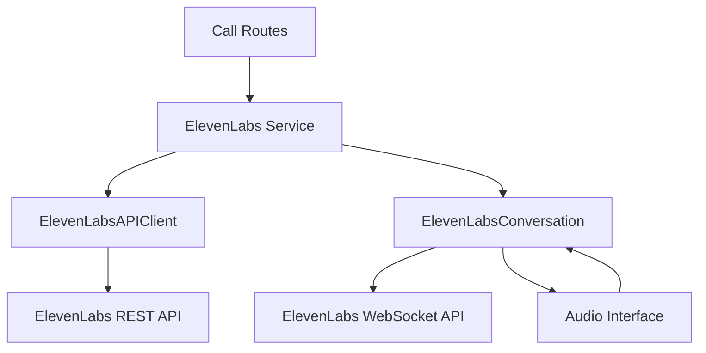

# ElevenLabs Integration Architecture

This document describes the architecture of the ElevenLabs integration in Pulsara IVR v2. It explains how we've replaced the ElevenLabs SDK with direct API calls for better stability and control.

## Overview

The ElevenLabs integration consists of three main components:

1. **ElevenLabsAPIClient**: A client for making direct API calls to ElevenLabs
2. **ElevenLabsConversation**: A handler for WebSocket-based conversations with ElevenLabs
3. **ElevenLabs Service**: A service layer that provides a consistent interface for the rest of the application

## Architecture Diagram



## Components

### ElevenLabsAPIClient

The `ElevenLabsAPIClient` class provides methods for making direct API calls to ElevenLabs. It handles authentication, request formatting, and error handling. The client is designed to be reusable and thread-safe.

Key features:
- Asynchronous API calls using `httpx`
- Proper error handling and logging
- Support for all ElevenLabs API endpoints
- File upload support for knowledge base documents

### ElevenLabsConversation

The `ElevenLabsConversation` class handles WebSocket-based conversations with ElevenLabs. It replaces the SDK's `Conversation` class with a direct WebSocket implementation for better stability and control.

Key features:
- WebSocket connection management
- Audio streaming
- Message handling
- Tool usage detection
- Callback support for agent responses and user transcripts

### ElevenLabs Service

The `elevenlabs.py` service provides a consistent interface for the rest of the application. It wraps the `ElevenLabsAPIClient` and `ElevenLabsConversation` classes and provides synchronous methods for ease of use.

Key features:
- Agent management (create, update, delete)
- Knowledge base management (sync, delete)
- Conversation creation and management
- System prompt template management

## API Endpoints

The ElevenLabs API has several endpoints that we use:

### Agent Management

- `POST /v1/convai/agents/create`: Create a new agent
- `GET /v1/convai/agents/:agent_id`: Get an agent by ID
- `PATCH /v1/convai/agents/:agent_id`: Update an agent

### Knowledge Base Management

- `GET /v1/convai/knowledge-base`: List all knowledge base documents
- `GET /v1/convai/knowledge-base/:documentation_id`: Get a knowledge base document by ID
- `POST /v1/convai/knowledge-base`: Create a new knowledge base document
- `DELETE /v1/convai/knowledge-base/:documentation_id`: Delete a knowledge base document

### Conversation Management

- `GET /v1/convai/conversations`: List conversations
- `GET /v1/convai/conversations/:conversation_id`: Get a conversation by ID
- `DELETE /v1/convai/conversations/:conversation_id`: Delete a conversation
- `GET /v1/convai/conversations/:conversation_id/audio`: Get the audio for a conversation

### WebSocket API

- `wss://api.elevenlabs.io/v1/convai/stream`: WebSocket endpoint for real-time conversations

## WebSocket Protocol

The WebSocket protocol for ElevenLabs conversations is as follows:

### Connection

To connect to the WebSocket, we send a request to `wss://api.elevenlabs.io/v1/convai/stream` with the following query parameters:
- `xi-api-key`: The ElevenLabs API key
- `agent_id`: The ID of the agent to converse with

### Message Types

The WebSocket protocol supports several message types:

#### Client to Server

- `audio`: Audio data from the user
- `interruption`: Signal to interrupt the agent's speech

#### Server to Client

- `agent_response`: Text response from the agent
- `audio`: Audio data from the agent
- `user_transcript`: Transcript of the user's speech
- `client_tool_call`: Tool call from the agent
- `error`: Error message

### Audio Format

Audio data is sent as base64-encoded strings in the following format:

```json
{
  "type": "audio",
  "data": "base64-encoded-audio-data"
}
```

### Tool Calls

Tool calls are sent in the following format:

```json
{
  "type": "client_tool_call",
  "data": {
    "name": "tool_name",
    "parameters": {
      "param1": "value1",
      "param2": "value2"
    }
  }
}
```

## Usage Examples

### Creating an Agent

```python
from app.services.elevenlabs import create_agent
from app.models.schemas import Agent

agent = Agent(
    name="Restaurant Agent",
    system_prompt={...},
    tools=[...],
    voice_id="voice_id"
)

agent_id = create_agent(agent)
```

### Starting a Conversation

```python
from app.services.elevenlabs import create_conversation

# Create a conversation
conversation = create_conversation(
    agent_id="agent_id",
    audio_interface=audio_interface,
    on_tool_use=on_tool_use,
    on_agent_response=on_agent_response,
    on_user_transcript=on_user_transcript
)

# Start the conversation
await conversation.start_session()

# End the conversation
await conversation.end_session()
```

## Error Handling

The ElevenLabs integration includes robust error handling to ensure that the application can recover from failures. Key error handling strategies include:

1. **Retries**: The `httpx` client is configured with retry settings to handle transient network issues.
2. **Fallbacks**: If the ElevenLabs API is unavailable, the application can fall back to default values or cached data.
3. **Logging**: All errors are logged with detailed information to aid in debugging.
4. **Graceful Degradation**: If a non-critical feature fails, the application will continue to function with reduced capabilities.

## Future Improvements

1. **Caching**: Implement caching for API responses to improve performance and reduce API calls.
2. **Rate Limiting**: Add rate limiting to prevent exceeding ElevenLabs API limits.
3. **Metrics**: Add metrics collection to monitor API usage and performance.
4. **Testing**: Add more comprehensive tests for the ElevenLabs integration.
5. **Documentation**: Expand this documentation with more examples and details.
